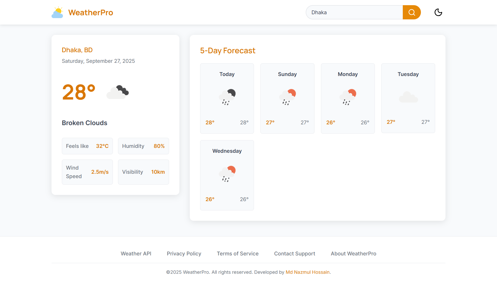
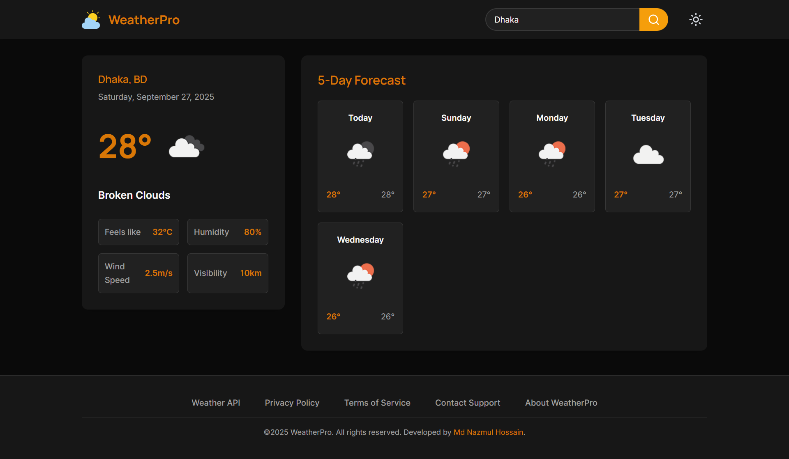

# 🌤️ Weather App

It is a weather forecast application built with **React.js**, **Tailwind CSS**, **Redux Toolkit**, and **OpenWeatherMap API**. This project is designed for **learning** enterprise-level React architecture and practicing API integration, state management, and clean folder structuring.

## 🚀 Features

- Search weather by **city name**  
- Display **current temperature, humidity, wind speed, visibility, and location**  
- Show **5-day forecast**
- Dark/Light theme toggle for eye comfort

## 🏗️ Tech Stack

- **Frontend:** React.js, Tailwind CSS  
- **State Management:** Redux Toolkit  
- **API:** [OpenWeatherMap](https://openweathermap.org/api)  
- **Build Tool:** Vite

## 📸 Project Screenshots

|  |  |
|:--:|:--:|

## 🏁 Getting Started

### Prerequisites
Before running the project, make sure you have installed the following:

- [Node.js](https://nodejs.org/)
- A code editor like [VS Code](https://code.visualstudio.com/)

### Setup Instructions
Follow these steps to get the project up and running locally:

1. **Clone the repository**
   ```sh
   git clone https://github.com/nazmulhossin/weather-app.git
   cd weather-app
   ```
2. **Install dependencies**
   ```sh
   npm install
   ```
3. **Rename `.env.example` to `.env`**

   Add your [OpenWeatherMap](https://openweathermap.org/) API key in `.env` file:
   ```env
   VITE_WEATHER_API_KEY=your_weather_api_key
   ```
5. **Run the development server**
   ```sh
   npm run dev
   ```
   
